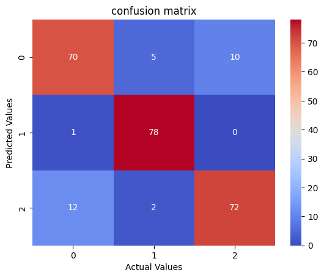

# 📈 Financial Sentiment Analysis with ModernBERT-Large & Unsloth

An end-to-end, high-performance pipeline for 3-class financial sentiment analysis (Positive, Neutral, Negative) leveraging **ModernBERT-large** and accelerated by **Unsloth** for fast and memory-efficient training.

[](https://www.python.org/)
[](https://pytorch.org/)
[](https://huggingface.co/)
[](https://github.com/unslothai/unsloth)


---

## 📌 Overview

Financial texts and headlines often feature domain-specific nuances, market jargon, and subtle tonalities that generic NLP models fail to capture. This repository demonstrates how to fine-tune **ModernBERT-large** for 3-class sequence classification on financial news headlines using **Unsloth's** fast patching and 8-bit optimization on a single commodity GPU (Tesla T4).

### Key Features:

* **Base Architecture**: `unsloth/ModernBERT-large` (395M+ trainable parameters).
* **Optimization**: Fast ModernBERT patching via Unsloth with `adamw_8bit` optimizer and gradient offloading.
* **Speed & Efficiency**: Full fine-tuning completed in **~2.5 minutes** for 3 epochs (120 steps) on a single **Tesla T4 (16GB VRAM)**.
* **High Performance**: Achieved **88.00% accuracy** on the unseen test set.

---

## 📊 Dataset & Preprocessing

The model is trained on the [Sentiment Analysis for Financial News](https://www.kaggle.com/datasets/ankurzing/sentiment-analysis-for-financial-news) dataset (Financial PhraseBank).

* **Total raw samples**: 4,846 rows (`text`, `labels`).
* **Class Balancing**: Downsampled to the minority class (`negative`), producing a balanced dataset of **604 samples per class** (1,812 total samples).
* **Data Splits**:
* **Train**: 70% (1,268 samples)
* **Validation**: 10% (181 samples)
* **Test**: 20% (363 samples)


* **Label Mapping**:
```python
id2label = {0: "neutral", 1: "negative", 2: "positive"}
label2id = {"neutral": 0, "negative": 1, "positive": 2}

```


---

## ⚙️ Training Setup & Hyperparameters

| Hyperparameter | Value | Description |
| --- | --- | --- |
| **Base Model** | `unsloth/ModernBERT-large` | 395M Parameters |
| **Max Sequence Length** | 2048 | Long-context support |
| **Precision** | FP16 / BF16 auto | Mixed precision |
| **Optimizer** | `adamw_8bit` | VRAM-saving 8-bit AdamW |
| **Batch Size** | 32 | Gradient accumulation = 1 |
| **Learning Rate** | `5e-5` | Linear warmup schedule |
| **Warmup Steps** | 5 | Smooth LR warmup |
| **Epochs** | 3 | Total 120 steps |
| **Weight Decay** | 0.0025 | L2 Regularization |

---

## 📈 Evaluation & Results

### Training & Validation Progression

| Step | Epoch | Training Loss | Validation Loss | Validation Accuracy |
| --- | --- | --- | --- | --- |
| 12 | 0.3 | 0.9289 | 0.8805 | 51.93% |
| 24 | 0.6 | 0.4963 | 0.5727 | 80.11% |
| 48 | 1.2 | 0.3100 | 0.5002 | 84.53% |
| 72 | 1.8 | 0.0683 | 0.3407 | **88.40%** |
| 96 | 2.4 | 0.0560 | 0.3755 | 87.29% |
| 120 | 3.0 | 0.0130 | 0.4426 | 86.19% |

### Final Test Set Evaluation

* **Test Accuracy**: **88.00%** on 250 evaluated test samples.

### Confusion Matrix

---

## 🚀 Quickstart & Inference

### 1. Installation

```bash
# Clone the repository
git clone [https://github.com/](https://github.com/)/.git
cd financial-news-sentiment-Modernbert


# Install pinned dependencies
pip install -r requirements.txt

```

### 2. Predict Sentiment on Custom Text

```python
from transformers import pipeline, AutoModelForSequenceClassification, AutoTokenizer
from unsloth import FastLanguageModel

# Load fine-tuned model and tokenizer
model_path = "bert_classification_lora"
classifier = pipeline("sentiment-analysis", model=model_path, tokenizer=model_path)

# Test sample headline
headline = "The company reported record quarterly revenue and expanded operating margins."
result = classifier(headline)

print(result)
# Output: [{'label': 'positive', 'score': 0.9145}]

```

---

## 📂 Repository Structure

```text
├── assets/
│   └── confusion_matrix.png       # Confusion matrix visualization
├── ModernBERT_Financial.ipynb # Complete training and inference notebook
├── requirements.txt               # Dependencies
└── README.md                      # Project documentation

```

---

## 📜 Acknowledgements

* [Unsloth](https://github.com/unslothai) for accelerating the fine-tuning pipeline.
* [Hugging Face](https://huggingface.co) for the transformers ecosystem.
* [Kaggle](https://www.kaggle.com) for hosting the Financial News Sentiment dataset.

---
